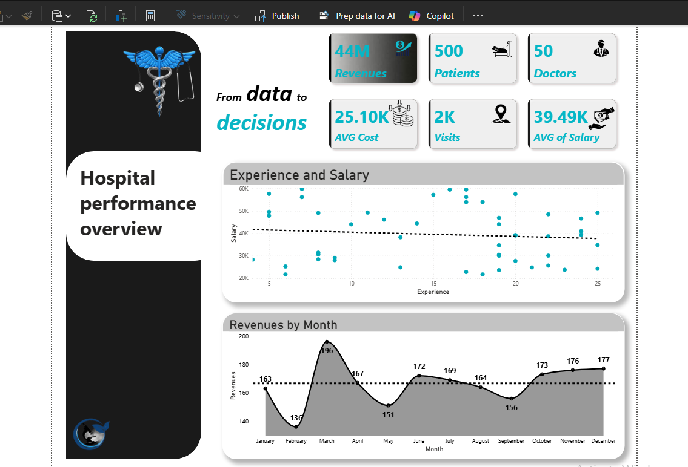
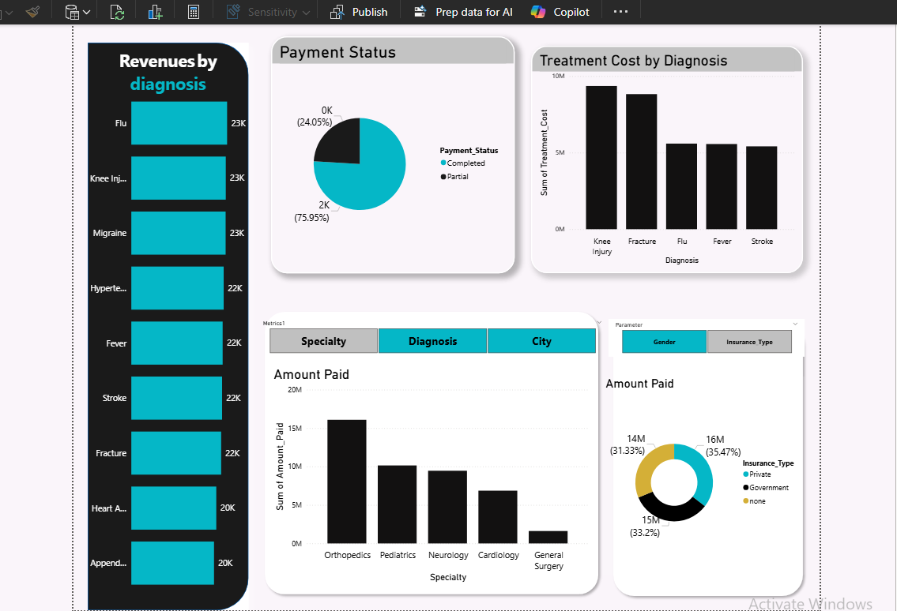
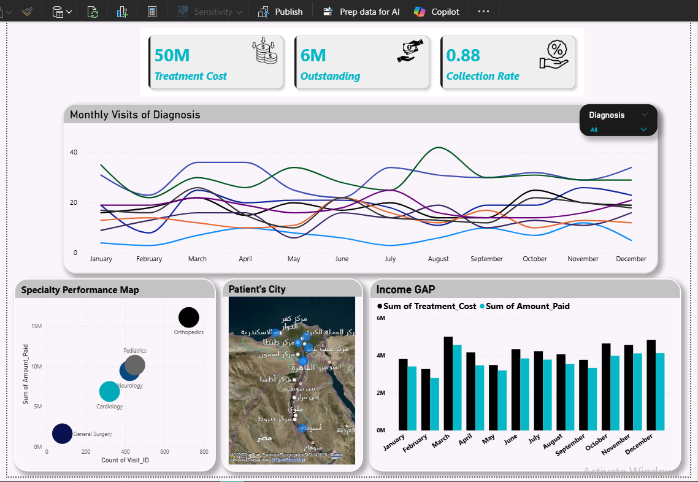

# 🏥 Hospital Performance Dashboard

A Power BI analytics project analyzing hospital operations — covering patient visits, treatment costs, payments, and doctor performance through an interactive 3-page dashboard.

## 🛠️ Tools Used
- **Excel** — cleaned and prepared the raw CSV data
- **Power BI Desktop** — dashboard design and data visualization
- **DAX** — custom measures (e.g. Revenue per Visit, Collection Rate, Outstanding balance)

## 🔄 Data Pipeline
1. **CSV** — raw hospital data (patients, visits, doctors, payments)
2. **Excel** — data cleaning and preprocessing (handling missing values, formatting, consistency checks)
3. **Power BI** — data modeling, relationships between tables, and dashboard building

## 📊 Dashboard Overview

### 1. Overview
A high-level snapshot of hospital performance, including:
- Total amount paid and total treatment cost
- Patient and doctor counts
- Monthly trend of patient visits over time
- Doctor salary vs. years of experience (scatter analysis)

### 2. Revenue by Diagnosis
Financial breakdown by diagnosis and specialty:
- Treatment cost by diagnosis
- Payment status breakdown (paid, pending, etc.)
- Revenue per visit by diagnosis
- Revenue by doctor specialty
- Payments breakdown by insurance type

### 3. Operational & Financial Insights
Deeper operational and geographic analysis:
- Monthly visits trend broken down by diagnosis
- Income gap between treatment cost and amount paid, by month
- Specialty performance map (cost vs. payments by specialty)
- Patient distribution by city (map view)
- Outstanding balance and collection rate

## 📈 Key Insights
- *(Add 2–4 real findings here, e.g. which diagnosis generates the highest revenue, which specialty has the best collection rate, seasonal patterns in visits, etc.)*

## 📁 Repository Contents
- `Hospital.pbix` — the original Power BI project file
- `Page1.png`, `Page2.png`, `Page3.png` — dashboard page screenshots

## 🔗 How to View
To explore the dashboard interactively, download [Power BI Desktop](https://powerbi.microsoft.com/desktop/) (free) and open `Hospital.pbix`.
